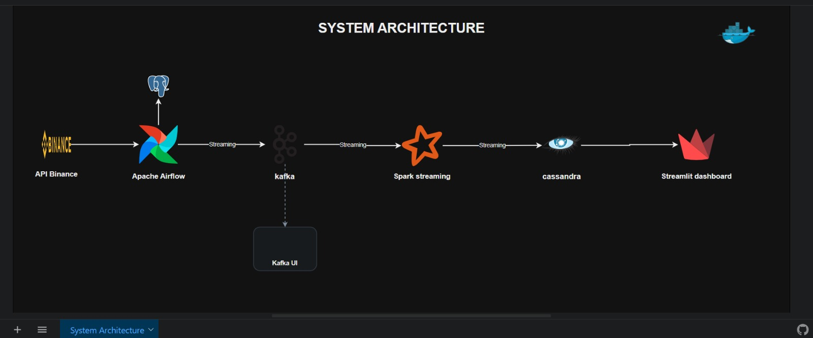

# Crypto Streaming Pipeline

Real-time cryptocurrency price streaming pipeline built with Apache Airflow, Apache Kafka (KRaft mode), Apache Spark Structured Streaming, Apache Cassandra, and a live Streamlit dashboard — fully containerized with Docker.

Live BTC, ETH, and SOL prices are pulled from the Binance public API every minute, streamed through Kafka, processed in real time by Spark, stored in Cassandra (raw records + rolling 1-minute averages), and visualized live in a Streamlit dashboard.

## Architecture



```
Binance API → Airflow → Kafka (KRaft) → Spark Structured Streaming → Cassandra → Streamlit dashboard
                                                                    (raw + aggregated)
```

| Component | Role |
|---|---|
| **Binance API** | Public, no-auth-required source of live crypto prices |
| **Apache Airflow** | Orchestrates data collection every minute; publishes prices to Kafka |
| **PostgreSQL** | Stores Airflow's internal metadata (DAG runs, scheduling state) |
| **Apache Kafka (KRaft mode)** | Streaming backbone — decouples ingestion from processing. Runs without Zookeeper, using Kafka's native KRaft consensus protocol |
| **Kafka UI** | Web interface to inspect topics and messages in real time |
| **Apache Spark (Structured Streaming)** | Consumes the Kafka topic continuously; writes raw prices and computes rolling 1-minute average prices per symbol |
| **Apache Cassandra** | Storage — one table for raw prices, one for 1-minute aggregates |
| **Streamlit dashboard** | Live web UI showing the latest price, price movement, and a chart per symbol, auto-refreshing every 5 seconds |
| **Docker Compose** | Orchestrates and networks all services together |

### Design decisions

- **Kafka runs in KRaft mode** (no Zookeeper) — the modern, simplified way to run Kafka.
- **No Schema Registry** — a single producer/consumer pair under one person's control uses plain JSON instead of Avro, keeping the pipeline simpler without losing correctness.
- **Kafka UI replaces Confluent Control Center** — a free, lightweight alternative for topic monitoring.
- **The dashboard runs inside Docker, on the same network as Cassandra**, rather than connecting from the host machine. This avoids a real-world issue encountered during development: on Windows, Docker Desktop's network virtualization layer can make the Cassandra binary protocol unstable when accessed via `localhost`, even though the port itself is reachable. Connecting through Docker's internal service network (`cassandra:9042`) avoids this entirely — the same reason Spark connects the same way.
- **The Cassandra Python driver uses the `libev` connection class** instead of the default `asyncore` reactor, for a more stable long-lived connection inside the container.

## Prerequisites

- [Docker](https://www.docker.com/) and Docker Compose
- ~4-6 GB of RAM available to Docker (Kafka, Spark, and Cassandra are memory-hungry)

## Getting started

```bash
git clone https://github.com/<your-username>/crypto-streaming-pipeline.git
cd crypto-streaming-pipeline
docker-compose up -d
```

Give it 1-2 minutes for all services to fully initialize on first startup. The dashboard container waits for Cassandra's healthcheck before starting.

### Access the UIs

| Service | URL | Credentials |
|---|---|---|
| Airflow | http://localhost:8080 | `admin` / `admin` |
| Kafka UI | http://localhost:8082 | — |
| Spark Master | http://localhost:8081 | — |
| **Dashboard** | **http://localhost:8501** | — |

## Running the pipeline

**1. Create the Kafka topic** (first run only):
```bash
docker exec -it <kafka-container-name> kafka-topics --create --topic crypto_prices --bootstrap-server localhost:9092 --partitions 1 --replication-factor 1
```

**2. Create the Cassandra keyspace and tables** (first run only):
```bash
docker exec -it <cassandra-container-name> cqlsh
```
```sql
CREATE KEYSPACE IF NOT EXISTS crypto_keyspace
WITH replication = {'class': 'SimpleStrategy', 'replication_factor': 1};

USE crypto_keyspace;

CREATE TABLE IF NOT EXISTS prices (
    symbol text,
    fetched_at timestamp,
    price double,
    PRIMARY KEY (symbol, fetched_at)
);

CREATE TABLE IF NOT EXISTS prices_avg_1min (
    symbol text,
    window_start timestamp,
    avg_price double,
    PRIMARY KEY (symbol, window_start)
);
```

**3. Activate the Airflow DAG** — go to the Airflow UI, find `crypto_price_stream`, and toggle it on. It runs automatically every minute, fetching BTC/ETH/SOL prices and publishing them to Kafka.


**4. Start the Spark Streaming job:**
```bash
docker exec -it <spark-master-container-name> /opt/spark/bin/spark-submit \
  --conf spark.jars.ivy=/tmp/.ivy2 \
  --packages org.apache.spark:spark-sql-kafka-0-10_2.12:3.5.0,com.datastax.spark:spark-cassandra-connector_2.12:3.5.0 \
  --conf spark.cassandra.connection.host=cassandra \
  /opt/spark-apps/spark_stream.py
```

This job runs continuously, consuming new Kafka messages as they arrive and writing to both Cassandra tables. It must be restarted manually after a `docker-compose down` / `up`, since it isn't a managed Compose service.

**5. Open the dashboard** at http://localhost:8501 to see live prices, a live chart, and the price movement over the displayed window — refreshing automatically every 5 seconds.


You can also verify the data directly:
```bash
docker exec -it <cassandra-container-name> cqlsh -e "SELECT * FROM crypto_keyspace.prices LIMIT 10;"
docker exec -it <cassandra-container-name> cqlsh -e "SELECT * FROM crypto_keyspace.prices_avg_1min LIMIT 10;"
```

Or browse messages live in the Kafka UI at http://localhost:8082.


## Project structure

```
.
├── docker-compose.yml       # All services and networking
├── Dockerfile                # Image for the Streamlit dashboard
├── requirements.txt          # Python dependencies for the dashboard
├── dashboard.py               # Streamlit dashboard: live prices, chart, auto-refresh
├── dags/
│   └── crypto_stream_dag.py  # Airflow DAG: fetches Binance prices, publishes to Kafka
├── spark/
│   └── spark_stream.py       # Spark job: consumes Kafka, writes raw + aggregated data to Cassandra
├── docs/
│   ├── architecture-diagram.jpeg
│   ├── airflow-dag-ui.png
│   ├── kafka-ui-messages.png
│   └── streamlit-live-dashboard.png
└── README.md
```

## What this project demonstrates

- Orchestrating scheduled data ingestion with Airflow
- Producing and consuming JSON messages with Kafka
- Structured Streaming with Spark: schema parsing, watermarking, windowed aggregations, and `foreachBatch` for sinks that don't natively support streaming `update` mode
- Data modeling in Cassandra with partition and clustering keys
- Building a live dashboard with Streamlit backed directly by a Cassandra data store
- Multi-container networking and debugging in Docker Compose: service name resolution, persistent volumes, container-to-container communication, healthchecks, and diagnosing a Windows-specific Docker networking issue with a binary protocol client

## Possible next steps

- Add more trading pairs
- Add alerting on significant price movements
- Scale out with multiple Spark workers
- Persist the Spark streaming job as a managed Compose service instead of a manual `spark-submit`

## License

This project is for educational purposes.
